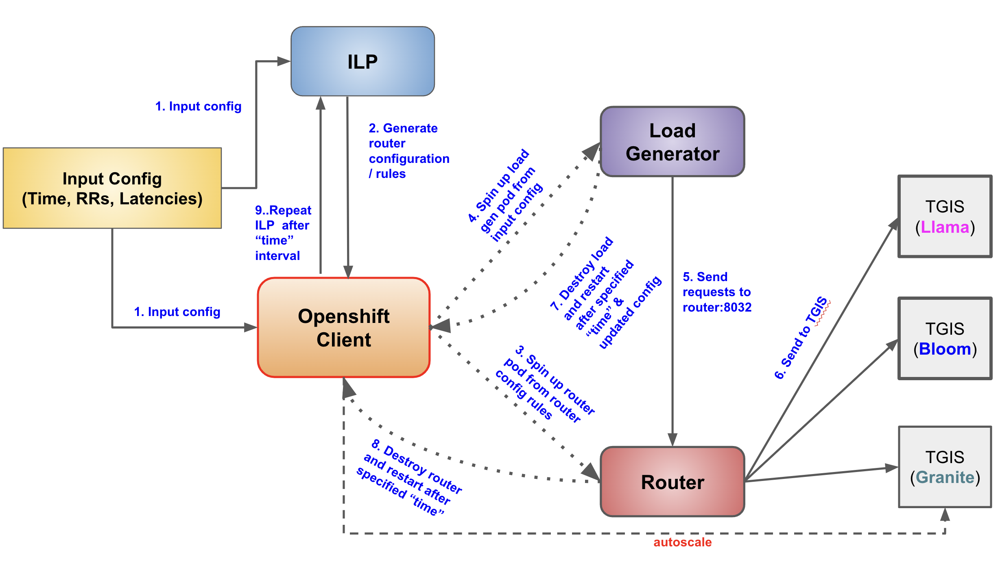
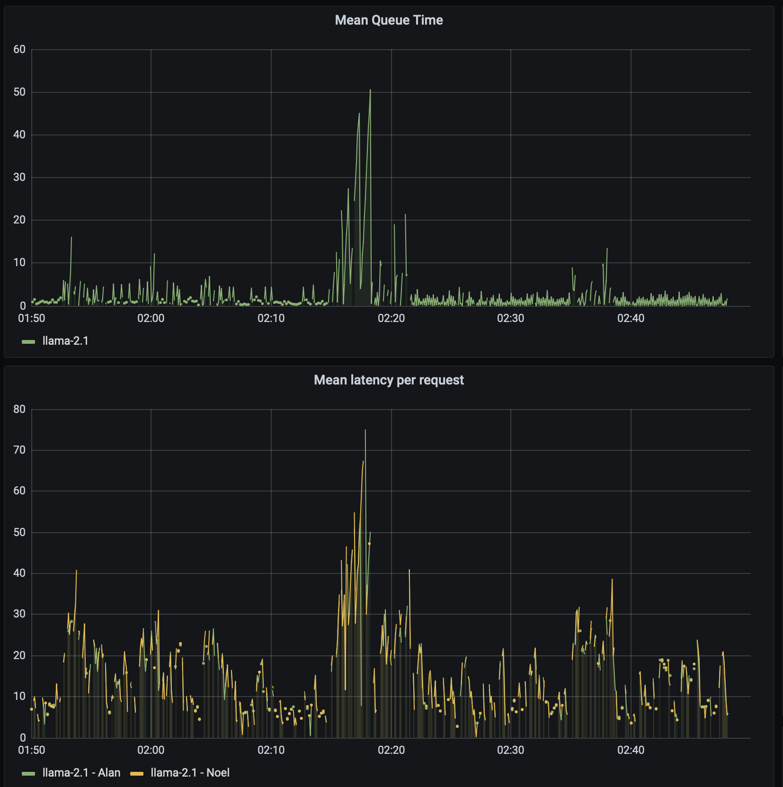
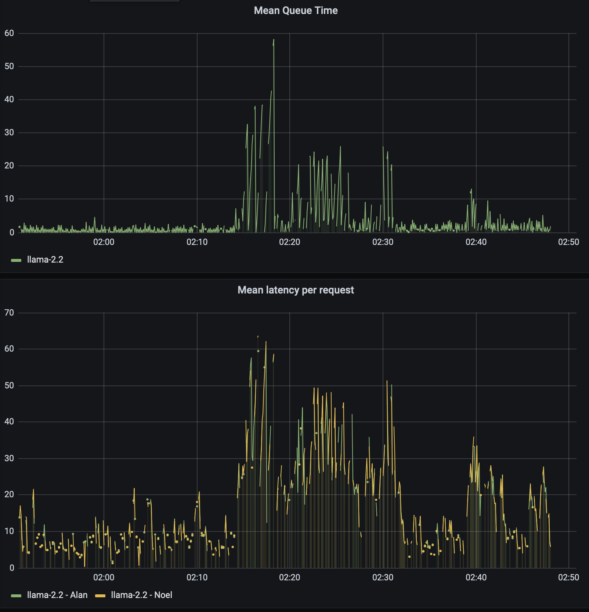

# Testing Framework: Supporting Multiple QoS Classes For LLM Inferencing



## Overview
Welcome to the Testing Framework designed to support multiple Quality of Service (QoS) classes for Large Language Model (LLM) inferencing. 
This framework is built to optimize resource allocation and ensure efficient handling of diverse user requests with varying latency requirements.


## Initial Author
Anubhav Jana, IBM Research

## Getting Started
1. **Prerequisites:**
   - Python 3.x
   - Kubernetes and OpenShift client libraries
   - JSON and YAML configuration files

2. **Execution:**
   ```bash
   ./run.sh


<h1> TEST CASE 1 - 2 User Classes - Alan (1) || Noel (2) </h1>


### Input Configuration (Iteration 1 : time instant 0 ---- Iteration 2 : after 30 mins)
For 12 RPM 
```json
{
    "updates": [
        {
            "time": 0,
            "request_rates": [10,14], 
            "latencies": [10,40]
        },
        {
            "time": 30,
            "request_rates": [15,21],
            "latencies": [10,40]
        }
    ]
}

```
For 14 RPM 
```json
{
    "updates": [
        {
            "time": 0,
            "request_rates": [16,12], 
            "latencies": [10,40]
        },
        {
            "time": 30,
            "request_rates": [18,24],
            "latencies": [10,40]
        }
    ]
}
```

### List of instance mapping 

> We used 3 replicas of the same mode (mode 2: 12 RPM) of Llama TGIS instance on A100 80 GB GPU

```python
llama-2.1 - 10.131.3.166
llama-2.2 - 10.128.5.22
llama-2.3 - 10.131.3.167
```

### Scenario (2 users - Alan and Noel)

> 1. Start with requests rates [14,10] and then after **30 mins**, updated load generator with updated rates - [15,21] with latency SLO the same for both.  
> 2. Optimal number = 2 instances -> Load Gen send requests only on 2 instances for 30 mins
> 3. After 30 mins, load generator is updated (new load generator) with [15,21] but keeps sending the requests to old router (2 instances) for **3 mins** [Hypothesis: Latency should increase]  
> 4. After 3 mins, the new load generator starts sending to new router ( 3 instances based on ILP decision) for 30 mins [Hypothesis: Latency should again start decreasing].


### Decisions by ILP 

#### Iteration 1 

```python
Status: Optimal
Objective value: 2.0
Selected Inference instances:
GPU Instance: Llama-8B A100 80GB (TGIS)-mode-2.1, IP: 10.131.3.166, Mode: 1
GPU Instance: Llama-8B A100 80GB (TGIS)-mode-2.2, IP: 10.128.5.22, Mode: 1

Rate allocation per user per GPU mode:
User Alan -> GPU Instance: Llama-8B A100 80GB (TGIS)-mode-2.1, IP: 10.131.3.166, Mode: 1, Rate: 4.711955
User Alan -> GPU Instance: Llama-8B A100 80GB (TGIS)-mode-2.2, IP: 10.128.5.22, Mode: 1, Rate: 5.288045
User Noel -> GPU Instance: Llama-8B A100 80GB (TGIS)-mode-2.1, IP: 10.131.3.166, Mode: 1, Rate: 7.288045
User Noel -> GPU Instance: Llama-8B A100 80GB (TGIS)-mode-2.2, IP: 10.128.5.22, Mode: 1, Rate: 6.711955
```

#### Iteration 2

```python
Status: Optimal
Objective value: 3.0
Selected Inference instances:
GPU Instance: Llama-8B A100 80GB (TGIS)-mode-2.1, IP: 10.131.3.166, Mode: 1
GPU Instance: Llama-8B A100 80GB (TGIS)-mode-2.2, IP: 10.128.5.22, Mode: 1
GPU Instance: Llama-8B A100 80GB (TGIS)-mode-2.3, IP: 10.131.3.167, Mode: 1

Rate allocation per user per GPU mode:
User Alan -> GPU Instance: Llama-8B A100 80GB (TGIS)-mode-2.1, IP: 10.131.3.166, Mode: 1, Rate: 4.4239101
User Alan -> GPU Instance: Llama-8B A100 80GB (TGIS)-mode-2.2, IP: 10.128.5.22, Mode: 1, Rate: 5.288045
User Alan -> GPU Instance: Llama-8B A100 80GB (TGIS)-mode-2.3, IP: 10.131.3.167, Mode: 1, Rate: 5.288045
User Noel -> GPU Instance: Llama-8B A100 80GB (TGIS)-mode-2.1, IP: 10.131.3.166, Mode: 1, Rate: 7.5760899
User Noel -> GPU Instance: Llama-8B A100 80GB (TGIS)-mode-2.2, IP: 10.128.5.22, Mode: 1, Rate: 6.711955
User Noel -> GPU Instance: Llama-8B A100 80GB (TGIS)-mode-2.3, IP: 10.131.3.167, Mode: 1, Rate: 6.711955
```

### Grafana Dashboard 




